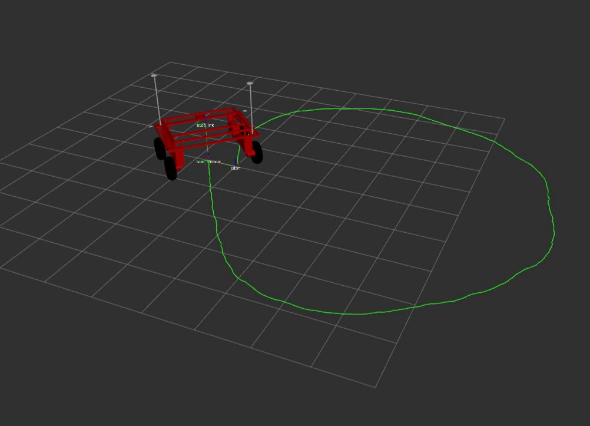

# Volcanibot Workspace

ROS 2 workspace for the Volcanibot, a four-wheel differential-drive field rover
for agricultural robotics. It runs both in Gazebo simulation and on the real
robot (Roboteq motor controller, Ouster lidar, RealSense camera, Trimble RTK
GPS), and includes a YOLO-based person-following demo.

<p align="center">
  
</p>

---

## Requirements

- Ubuntu 24.04
- ROS 2 Jazzy
- `python3-vcstool`
- conda (for the Python deps used by YOLO / person-following)

## Packages

These are the packages developed in this repo:

| Package | What it is |
|---------|------------|
| `volcanibot_bringup` | Top-level launch files for sim and real robot, plus GPS/perception sub-launches and configs |
| `volcanibot_description` | URDF/xacro, meshes, Gazebo worlds, RViz config |
| `volcanibot_controller` | diff_drive_controller params (sim + real), joystick teleop, twist_mux arbitration |
| `volcanibot_hardware_interface` | ros2_control hardware interface for the Roboteq motor controller (C++), udev rule, bench scripts |
| `volcanibot_follow_person` | Person-following node: follows the closest person from YOLO detections |

Third-party packages are **not** committed here. They are pulled into `src/`
with [vcstool](https://github.com/dirk-thomas/vcstool) (see `volcanibot.repos`)
and gitignored:

| Package | Source (pinned) |
|---------|-----------------|
| `yolo_ros` | https://github.com/omribu/yolo_ros (fork that drops `uv sync` for the Jetson) |
| `trimble_driver_ros` | https://github.com/trimble-oss/trimble_driver_ros (pinned to the pre-rename commit) |

## How it fits together

Velocity commands flow through `twist_mux`, which picks the highest-priority
source and forwards it to the controller:

```
joystick  ──► /joy_vel  (priority 100) ─┐
                                         ├─► twist_mux ──► /volcanibot_controller/cmd_vel ──► diff_drive_controller ──► wheels
follow-person ──► /nav_vel (priority 50)─┘                 ▲
                                       /safety_stop (lock, priority 255) ─┘
```

Everything is `geometry_msgs/TwistStamped` end to end. Hold the deadman button
to drive with the joystick; it overrides autonomy.

Camera topics are the same in sim and on the real robot (`/camera/image`,
`/camera/depth_image`, `/camera/camera_info`, `/camera/points`), so the YOLO
perception layer doesn't care which one is running.

## Setup on a new PC

```bash
# 1. Clone
mkdir -p ~/workspaces && cd ~/workspaces
git clone <this-repo-url> volcanibot_ws
cd volcanibot_ws

# 2. Pull the third-party packages (yolo_ros, trimble_driver_ros)
sudo apt install python3-vcstool
vcs import src < volcanibot.repos

# 3. System / ROS dependencies (installs ouster, realsense, robot_localization,
#    geographiclib, libpcap, boost, ... via apt)
source /opt/ros/jazzy/setup.bash
rosdep install --from-paths src --ignore-src -r -y

# 4. Python deps for YOLO / person-following, in a conda env
conda create -n volcanibot python=3.12
conda activate volcanibot
pip install -r requirements.txt
# torch: install a CUDA-matched build for your machine (NVIDIA wheel on the Jetson).
# opencv comes from ROS (python3-opencv) — do NOT pip install opencv-python.

# 5. Build
colcon build --symlink-install
source install/setup.bash
```

### Real robot — udev rule for the Roboteq

The hardware interface expects the Roboteq at the stable symlink `/dev/roboteq`.
Plug in the controller and run the installer once — it detects the device and
writes the udev rule:

```bash
src/volcanibot_hardware_interface/udev/install.sh
```

## Running

### Simulation

```bash
ros2 launch volcanibot_bringup sim_bringup.launch.py
```

Useful args (all default off unless noted):

| Arg | Default | Description |
|-----|---------|-------------|
| `world_name` | `feild` | Gazebo world: `empty`, `feild`, or `farm` |
| `lidar` | `false` | Spawn the Ouster lidar and bridge `/scan`, `/scan/points` |
| `camera` | `false` | Spawn the RGBD camera and bridge `/camera/*` |
| `rviz` | `true` | Open RViz with the default config |
| `joystick` | `true` | Launch joystick + joy_teleop (set `false` if no gamepad) |
| `yolo` | `false` | Run YOLO detection on the camera stream (needs `camera:=true`) |
| `yolo_device` | `cuda:0` | Inference device — use `cpu` on a machine without a GPU |
| `follow` | `false` | Run person-following (needs `yolo:=true`) |

Example — full perception demo on a CPU laptop:

```bash
ros2 launch volcanibot_bringup sim_bringup.launch.py camera:=true yolo:=true follow:=true yolo_device:=cpu
```

### Real robot

```bash
ros2 launch volcanibot_bringup real_bringup.launch.py
```

Useful args:

| Arg | Default | Description |
|-----|---------|-------------|
| `lidar` | `false` | Include the Ouster lidar and launch `ouster_ros` |
| `camera` | `false` | Include the RealSense camera and launch its driver |
| `gps` | `false` | Include the GPS antennas and launch the Trimble GSOF client + navsat |
| `rviz` | `true` | Open RViz |
| `joystick` | `true` | Launch joystick + joy_teleop |
| `yolo` | `false` | Run YOLO detection (needs `camera:=true`) |
| `yolo_device` | `cuda:0` | Inference device (`cuda:0` on the Jetson) |
| `yolo_model` | `yolov8n.pt` | Weights; absolute path or a rebuilt `.engine` for the field |
| `follow` | `false` | Run person-following (needs `yolo:=true`) |
| `serial_port` | `/dev/roboteq` | Roboteq serial device |
| `baud_rate` | `115200` | Roboteq baud rate |
| `sensor_hostname` | `os-122000000000.local` | Ouster lidar hostname/IP |
| `ouster_params_file` | `""` | Optional custom ouster driver params |

> Note: the GPS driver only builds after `rosdep install` has pulled its system
> deps (geographiclib, libpcap, boost). The receiver IP/port live in
> `src/volcanibot_bringup/config/gsof_client_params.yaml`.

### Roboteq bench scripts

For hardware bring-up there are two standalone serial tools in
`src/volcanibot_hardware_interface/scripts/` (`test_roboteq.py`,
`interactive_roboteq.py`). They send motor commands directly, so they are
**bench-only** — see the README in that folder before using them.

## Updating third-party packages

```bash
vcs pull src                                   # pull latest on each third-party repo
vcs export src --exact > volcanibot.repos      # refresh the pinned versions
```
